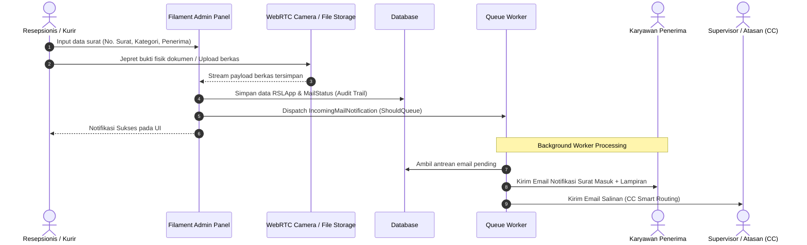
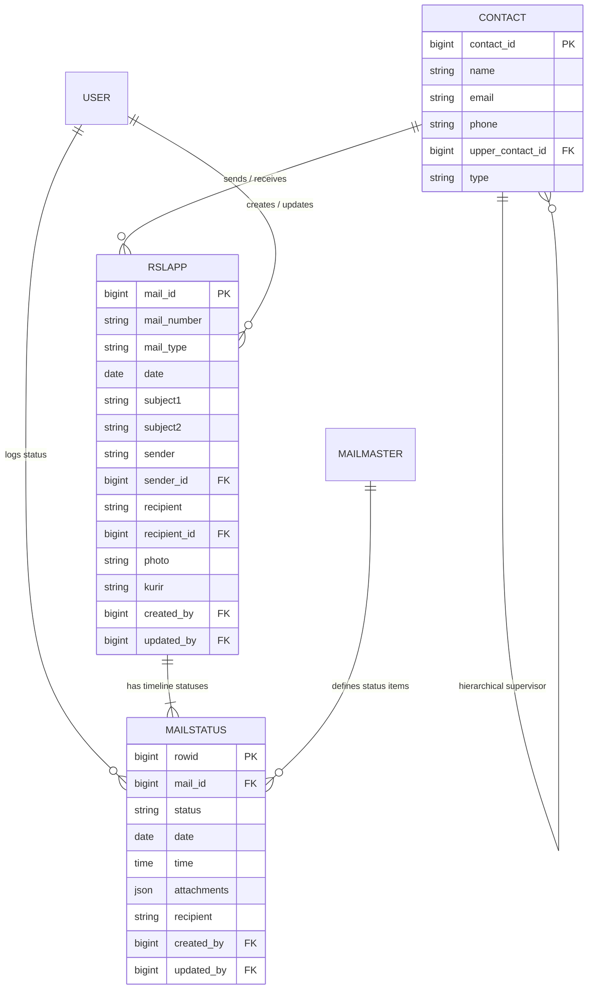

<div align="center">

# 📬 Mail Management & Digital Archive System
### Enterprise Correspondence Archiving, Tracking & Audit Trail Platform

[](https://laravel.com)
[](https://filamentphp.com)
[](https://www.php.net)
[](https://livewire.laravel.com)
[](https://alpinejs.dev)
[](https://tailwindcss.com)
[](LICENSE)

<p align="center">
  Aplikasi manajemen dan pengarsipan korespondensi surat perusahaan modern (Surat Masuk & Surat Keluar) yang dilengkapi penangkapan foto bukti fisik via WebRTC kamera, verifikasi keamanan berkas PDF sensitif, antrean notifikasi email otomatis (asynchronous queue), serta pemantauan delivery status secara end-to-end.
</p>

[Fitur Utama](#-fitur-utama) • [Sorotan Teknis](#-sorotan-teknis--arsitektur) • [Alur Sistem](#-alur-sistem--diagram) • [Instalasi](#-instalasi--konfigurasi) • [Struktur Proyek](#-struktur-proyek) • [Author](#-author)

</div>

---

## 📌 Ringkasan Proyek (Overview)

Dalam alur operasional perkantoran modern, pengelolaan dokumen fisik seperti surat masuk, surat keluar, paket, dan faktur (*purchasing*) sering kali menghadapi tantangan: dokumen hilang, lambatnya distribusi ke penerima, status serah-terima kurir yang tidak tercatat, serta risiko kebocoran dokumen rahasia.

**Mail Management & Digital Archive System** dirancang untuk mendigitalkan dan mengamankan seluruh siklus hidup surat perusahaan:
- **Pencatatan Cepat & Adaptif**: Formulir dinamis otomatis menyesuaikan field pengirim dan penerima berdasarkan jenis surat (*incoming* vs *outgoing*).
- **Direct Camera Physical Proof**: Integrasi perangkat kamera web untuk memotret fisik surat / kurir secara instan saat resepsionis menerima dokumen.
- **Enterprise-Grade Security**: Penyimpanan berkas di storage privat terenkripsi dan proteksi *password challenge* sebelum dokumen PDF sensitif dapat dibuka.
- **Asynchronous Background Processing**: Pengiriman notifikasi email otomatis dengan *smart CC routing* ke atasan tanpa membebani performa request pengguna.

---

## ✨ Fitur Utama

### 1. 📥 Manajemen Surat Masuk & Keluar (Incoming & Outgoing Mail)
- **Dynamic Context-Aware Forms**: Input otomatis berubah dinamis sesuai tipe surat:
  - *Surat Masuk*: Pengirim dari pihak luar (eksternal) dan penerima dipilih dari buku kontak internal.
  - *Surat Keluar*: Pengirim adalah personil internal perusahaan dan penerima adalah entitas eksternal.
- **Kategorisasi Dokumen**: Segmentasi jenis surat (*Purchasing* vs *Non-Purchasing*) dengan penanganan subjek kustom.
- **Pencatatan Kurir & Tanggal Ganda**: Melacak tanggal surat dibuat, tanggal diterima/dikirim, serta nama kurir atau ekspedisi pengantar.

### 2. 📷 Integrasi Kamera Langsung (WebRTC Direct Capture) & Multi-Upload
- **Custom Camera Component**: Mengambil foto bukti fisik dokumen langsung dari kamera laptop/webcam secara *real-time* berbasis HTML5 Canvas & WebRTC API.
- **Base64 to Storage Stream**: Konversi otomatis data gambar Base64 menjadi file fisik aman di storage lokal dengan penamaan string acak anti-konflik.
- **Multi-File Attachment**: Dukungan multi-lampiran hingga 5 file sekaligus (PDF, JPG, PNG) dengan layout grid interaktif.

### 3. 🔐 Keamanan Berkas & Password Gate Dokumen PDF
- **Private Storage Streaming**: Seluruh berkas lampiran disimpan di disk privat (bukan direktori publik) dan hanya dapat diakses melalui route controller terverifikasi.
- **PDF Password Challenge Gate**: Fitur keamanan eksklusif di mana pengguna wajib memasukkan password akun mereka saat hendak membuka pratinjau lampiran PDF sensitif untuk mencegah akses tidak sah pada sesi layar terbuka.
- **Interactive Lightbox Preview**: Tampilan pratinjau gambar responsif tanpa me-reload halaman.

### 4. 📬 Notifikasi Email Asinkron & Smart Routing (Queued Mails)
- **Background Queue Worker**: Notifikasi dikirimkan melalui sistem antrean (`ShouldQueue`) berbasis worker database agar respons sistem tetap instan.
- **Intelligent Hierarchy Routing**: Otomatis mengirim email konfirmasi ke penerima dan melampirkan CC ke atasan langsung (*upper contact*) atau supervisor departemen terkait (*Purchasing / Non-Purchasing*).
- **Embedded File Attachments**: Email notifikasi otomatis menyertakan lampiran foto bukti terima dokumen.

### 5. 🏢 Buku Kontak Berjenjang (Hierarchical Organization Contacts)
- Menyimpan direktori entitas, karyawan, dan departemen perusahaan.
- Relasi hirarki (*parent-child relationship*) antar kontak untuk penentuan struktur atasan-bawahan secara otomatis.

### 6. 📊 Tracking Status Berantai & Dashboard Real-Time
- **Multi-Stage Delivery Status**: Melacak riwayat perjalanan surat (misal: *Received by receptionist* ➔ *Lantai 29* ➔ *Received by user*).
- **Live Metric Widgets**: Ringkasan total arsip dokumen, surat masuk hari ini, surat keluar hari ini, serta perbandingan volume purchasing vs non-purchasing.
- **Audit Trails**: Pelacakan otomatis `created_by` dan `updated_by` hingga level pengguna untuk setiap mutasi data.
- **Role-Based Access Control (RBAC)**: Integrasi Filament Shield untuk pemisahan hak akses admin, resepsionis, dan staf.

---

## 🛠️ Sorotan Teknis & Arsitektur

Aplikasi ini dibangun mengedepankan prinsip *Clean Architecture*, efisiensi performa, dan standar keamanan Laravel:

| Layer / Aspek | Teknologi / Pendekatan | Penjelasan Implementasi |
| :--- | :--- | :--- |
| **Framework Core** | **Laravel 12 (PHP 8.2+)** | Memanfaatkan fitur modern PHP 8.2+ (Typed Properties, Match Expressions, First-Class Callables). |
| **Admin Panel & UI** | **Filament v4.3 + Livewire 3** | Admin dashboard reaktif berbasis Blade Component, Livewire, dan Tailwind CSS tanpa overhead SPA terpisah. |
| **Security Gate** | **Dynamic Password Verification** | Controller `VerifyPasswordController` memvalidasi kredensial pengguna secara dinamis via AJAX sebelum memberikan akses membuka PDF sensitif. |
| **File Storage** | **Local Private Disk Streaming** | Akses file melalui route terisolasi `view.private.image` menggunakan `Storage::response()`, mencegah kebocoran file via URL publik langsung. |
| **Hardware Capture** | **WebRTC + Alpine.js + Canvas** | Komponen kustom Blade & Alpine.js untuk kontrol kamera (*stream capture*, *freeze frame*, *retake*, *snapshot payload*). |
| **Queue & Worker** | **Database Queue + Jobs Monitor** | Pengiriman email `IncomingMailNotification` via antrean latar belakang termonitor visual menggunakan Filament Jobs Monitor. |
| **Access Control** | **Filament Shield (Spatie RBAC)** | Manajemen role & permission granular per Resource, Form Action, dan Widget. |
| **Data Integrity** | **Model Booted Lifecycle Hooks** | Otomatisasi perekaman identitas user (`created_by`, `updated_by`) dan pembersihan file yatim (*cascade file cleanup*) pada event model `deleting`. |

---

## 🔄 Alur Sistem & Diagram

### 1. Siklus Penerimaan Surat & Notifikasi Asinkron


### 2. Entity Relationship Diagram (ERD) Ringkas


---

## 📁 Struktur Proyek

```plaintext
arsip-surat-app/
├── app/
│   ├── Filament/
│   │   ├── Pages/                     # Halaman custom Filament (Profile, dsb.)
│   │   ├── Resources/
│   │   │   ├── Contacts/              # Manajemen buku kontak & atasan
│   │   │   ├── RSLApps/               # Manajemen arsip surat utama
│   │   │   │   ├── Pages/             # Create, Edit, View, List halaman RSLApp
│   │   │   │   ├── Schemas/           # Infolist & Form Schema (Dynamic fields)
│   │   │   │   └── Tables/            # Table configuration, filter & action
│   │   │   └── Users/                 # Manajemen pengguna sistem
│   │   └── Widgets/                   # Dashboard widgets (Stats & Latest Mails)
│   ├── Forms/Components/              # Custom Filament Form Component (CameraField)
│   ├── Http/Controllers/              # VerifyPasswordController (PDF Gate)
│   ├── Mail/                          # IncomingMailNotification (Mailable ShouldQueue)
│   ├── Models/                        # RSLApp, MailStatus, Contact, MailMaster, User
│   └── Providers/Filament/            # AdminPanelProvider (Theme, Shield, Hooks)
├── resources/
│   └── views/
│       ├── filament/components/       # Camera script & Global Lightbox Blade
│       ├── forms/components/          # Blade template view WebRTC Camera capture
│       ├── infolists/components/      # Lightbox viewer & PDF Password modal
│       └── mail/                      # Template email notifikasi responsif
├── database/                          # Migrations & Seeders
└── routes/
    └── web.php                        # Private file stream & password gate routes
```

---

## 🚀 Instalasi & Konfigurasi

Ikuti langkah-langkah berikut untuk menjalankan proyek di lingkungan lokal:

### 1. Prasyarat Sistem
- **PHP** >= 8.2 (dengan ekstensi `pdo`, `mbstring`, `openssl`, `fileinfo`)
- **Composer** >= 2.x
- **Node.js & NPM** >= 18.x
- Database: **PostgreSQL** atau **MySQL** / **SQLite**

### 2. Kloning & Dependensi
```bash
# Clone repository
git clone https://github.com/Pilalz/arsip-surat.git
cd arsip-surat

# Install dependensi PHP
composer install

# Install dependensi frontend
npm install
```

### 3. Konfigurasi Lingkungan (`.env`)
Salin file konfigurasi environment dan generate kunci aplikasi:
```bash
cp .env.example .env
php artisan key:generate
```

Sesuaikan konfigurasi database dan mailer pada file `.env`:
```env
APP_NAME="Mail Management"
APP_URL=http://localhost:8000

DB_CONNECTION=sqlite
# Atau PostgreSQL / MySQL:
# DB_CONNECTION=pgsql
# DB_HOST=127.0.0.1
# DB_PORT=5432
# DB_DATABASE=arsip_surat
# DB_USERNAME=postgres
# DB_PASSWORD=secret

QUEUE_CONNECTION=database
FILESYSTEM_DISK=local

MAIL_MAILER=smtp
MAIL_HOST=smtp.mailtrap.io
MAIL_PORT=2525
MAIL_USERNAME=your_user
MAIL_PASSWORD=your_password
MAIL_FROM_ADDRESS="no-reply@company.com"
MAIL_FROM_NAME="${APP_NAME}"
```

### 4. Migrasi & Shield Setup
Jalankan migrasi database dan inisialisasi permission Filament Shield:
```bash
# Jalankan migrasi database
php artisan migrate

# Generate super admin untuk akses panel
php artisan shield:super-admin

# Atau buat user admin Filament standar
php artisan make:filament-user
```

### 5. Menjalankan Aplikasi & Queue Worker
Jalankan development server dan queue worker secara paralel:
```bash
# Menjalankan server aplikasi
php artisan serve

# Menjalankan worker antrean email di terminal terpisah
php artisan queue:listen --tries=1

# Compile aset frontend Vite
npm run dev
```

Buka peramban Anda di: **`http://localhost:8000/admin`**

---

## 🛡️ Keamanan & Integritas Data

- **Access Token & CSRF Protection**: Seluruh request form dilindungi oleh token CSRF.
- **Sensitive PDF Challenge Verification**: Meminimalkan risiko dokumen rahasia terintip di layar kerja bersama melalui otentikasi ulang instan.
- **Private Stream Isolation**: File lampiran tidak dapat di-scrape atau diakses langsung melalui URL publik file statis.
- **Automatic Soft/Cascade Cleaners**: Penghapusan surat otomatis membersihkan entri relasi status dan menghapus file fisik di penyimpanan untuk mencegah file yatim (*orphaned files*).

---

## 👨‍💻 Author

Dikembangkan oleh:
- **Rafi Hilal Zahir** - [*@Pilalz*](https://github.com/Pilalz)
- Kontak: `rafihilalzahir@gmail.com`

---

## 📄 Lisensi

Proyek ini dilisensikan di bawah [MIT License](LICENSE).
